# AirBnB Kaggle Competition Writeup

For the Computer Science 671 class at Duke University.

Find the PDF version of this writeup [here](https://github.com/Sam-B-Y/ML-AirBnB-Price-Predictions/blob/main/writeup.pdf)

## Exploratory Analysis

To understand the provided dataset, I began by visualizing the target variable using histograms to check for imbalance, which would influence how I approached the problem. The dataset appeared fairly balanced, although I anticipated that listings with extreme prices—both the cheapest and most expensive—might be easier to predict due to the fact that "obvious" outliers would fit in this category (like a listing with a price of 10 dollars or 999 dollars), even though only listings of a price between \$0 and \$1000 were included in the dataset as per the Kaggle rules.

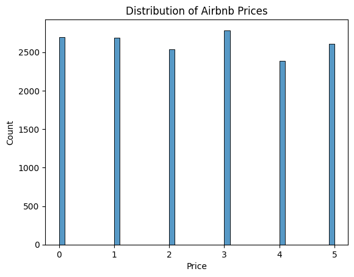

Next, I examined the distribution of numerical variables and observed that many were zero-inflated, which poses challenges for modeling. This made me want to use decision tree based models, as they could split between zero and non-zero values, and would not be affected by the zero-inflation as much as linear models would be.

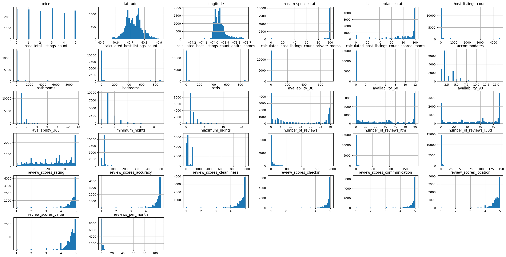

### Data Cleaning

Initial data inspection using the `.head()` function revealed several issues: text features (name, description, reviews, amenities), missing values (primarily in review features), redundant variables, and improperly formatted timestamp and boolean variables. Boolean values were mapped from "True" to 1 and "False" to 0, and timestamps were converted to the number of days since the project release date. For textual variables, one-hot encoding was applied to `room_type` for categorical representation (dropping `property_type`, which had similar information but represented room types in multiple ways). Finally, I mapped `host_response_time` to a score from 1 to 10 and `host_verifications` to a score from 0 to 3 based on the number of verification methods used.

### Feature Engineering

#### Neighborhood

Location is a critical factor in determining listing prices. The neighborhood variable had numerous unique values, making one-hot encoding impractical, as opposed to the neighborhood group variable which I one-hot encoded. Thus, I computed the average price per person in each neighborhood. To ensure reliability, this average was included only for neighborhoods with more than five listings, with missing values imputed using the nearest neighborhood's average price per person. I also included the distance to key landmarks in New York City, such as Times Square as I thought these could influence listing prices.

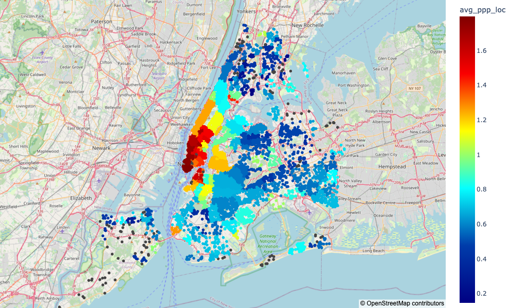
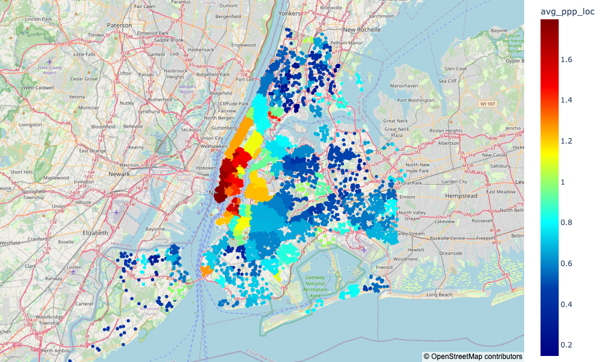

Comparing this to median rent prices in New York confirmed that the average price per person is a suitable proxy for the cost of living in each neighborhood.

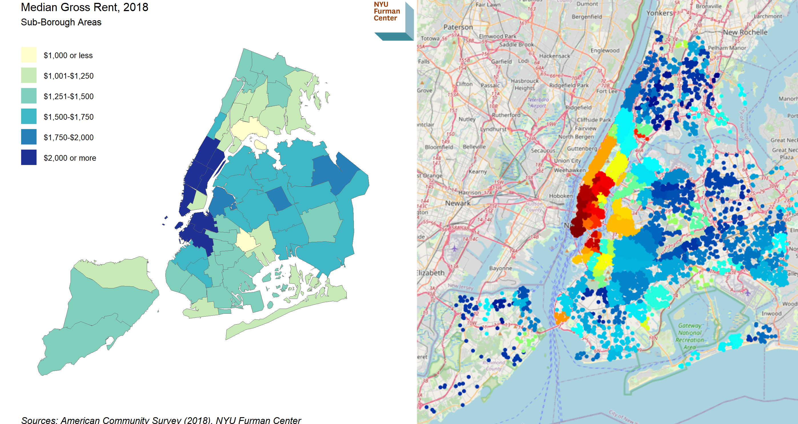

#### NLP

For text features, I focused on the amenities array, which contained 4,637 unique amenities. To manage this, I identified the most common amenities and used the `fuzzywuzzy` library to standardize them into 12 binary columns (e.g., 'wifi', 'tv', 'air conditioning') using an 80% similarity threshold. Additionally, I created a feature representing the total number of amenities per listing.

For reviews, I employed sentiment analysis using the ChatGPT API on the first 2,000 characters of each review to obtain sentiment scores between 0 and 1. I averaged these scores per listing to create a sentiment feature. Due to API rate limits and computational constraints, not all reviews could be analyzed, which may have affected the accuracy of the sentiment feature. I also included the average length of reviews as an indicator of review detail and trustworthiness.

Lastly, I performed sentiment analysis on the combined name and description text of listings. Given the dataset size of 15,000 rows, I avoided text vectorization to reduce dimensionality, as I didn't think models could learn enough from that amount of data points.

### Imputation

Handling missing values was important as some features had over 4,000 missing values, representing a quarter of the dataset:

| **Feature**                 | **Missing Values** |
| --------------------------- | ------------------ |
| review_sentiment            | 4459               |
| review_scores_location      | 4456               |
| review_scores_rating        | 4455               |
| review_scores_accuracy      | 4455               |
| review_scores_cleanliness   | 4455               |
| review_scores_checkin       | 4455               |
| review_scores_communication | 4455               |
| review_scores_value         | 4455               |
| reviews_per_month           | 4455               |
| time_since_first_review     | 4455               |
| time_since_last_review      | 4455               |
| avg_review_length           | 4455               |
| host_response_time          | 2203               |
| host_response_rate          | 2203               |
| host_acceptance_rate        | 2052               |
| ...                         | ...                |

Examining this table, it was clear that missing values were not random. For instance, some rows lacked reviews or host responses entirely. I introduced indicators for missingness, such as `no_reviews` and `no_host_response`, to capture these patterns. For other features, the reasons for missing data were less apparent.

To handle missing values, I used several imputation strategies. For binary features like `host_is_superhost`, missing values were imputed with 0, assuming the absence of the attribute. Continuous numerical features were imputed using the column mean. Key features such as `accommodates`, `bathrooms`, and `beds` were imputed using the K-Nearest Neighbors Imputer from the `sklearn` library to ensure accurate estimates based on similar data points.

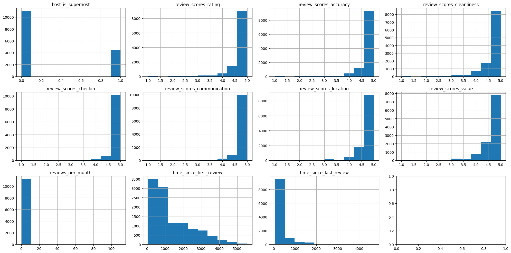

### Correlation Analysis

I plotted the correlation matrix to identify highly correlated features. This revealed several categories of data that were strongly related, such as review scores and availability features. I used this information to try to reduce dimensionality and avoid multicollinearity in the models.

The availability features, representing the number of available days over different periods (30, 60, 90, and 365 days), were highly correlated. I converted these into percentage availability and applied Principal Component Analysis (PCA) to reduce dimensionality. The first principal component explained 94% of the variance, so I retained only this component for the 30, 60, and 90-day availability, while keeping the 365-day availability separate due to its lower correlation and distinct distribution.

Although the review scores were also highly correlated, the first 2 dimensions of the PCA only accounted for 0.82 of the variance total, so I retained the original features to preserve information.

Finally, I also dropped some of the listing information that seemed to be copies of other features, such as `host_listings_count` and `host_total_listings_count`, which both had counterparts with "calculated" in front. Similarly, I dropped `room_type_Hotel room`.

I decided to not touch the distance features, as even though they were highly correlated, I thought they could still provide useful information to the model.

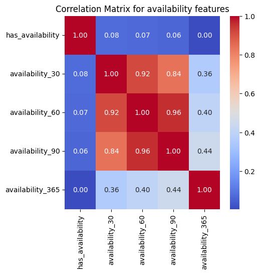
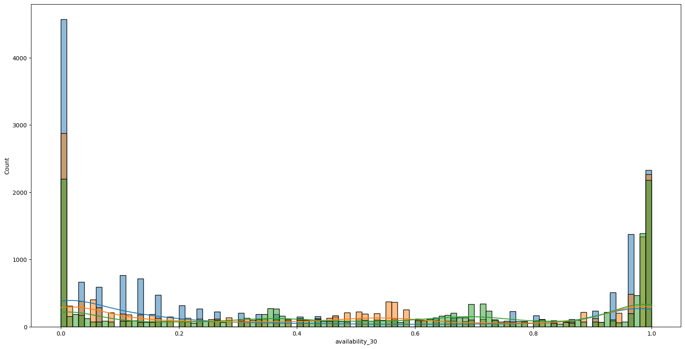

## Models

Given the non-linear relationships and unbalanced features observed in the exploratory analysis, I selected tree-based models, specifically LightGBM and Random Forest, for prediction tasks. These models are well-suited for handling complex interactions and are robust against overfitting, especially with the appropriate hyperparameter tuning.

I chose LightGBM for its computational efficiency and ability to handle large datasets with high-dimensional features through its histogram-based algorithm. LightGBM is faster than XGBoost and supports parallel and GPU-based training, making it ideal for iterative model development and hyperparameter tuning.

I then chose Random Forests for its proven performance, ease of use with the scikit-learn library, and its ability to provide feature importance insights. Random Forest is effective in reducing variance through ensemble learning and is less prone to overfitting compared to individual decision trees.

Both models were implemented as regression models to predict prices, which were then rounded to the nearest integer and clipped between 0 and 5 to align with the target variable's scale. I chose regression models over classification as the former performed better in the exploratory analysis, even when rounding to calculate the score.

## Training

### LightGBM

I implemented a LightGBM model using the `LGBMRegressor` from the LightGBM library, which employs a gradient boosting framework. The primary reason for selecting LightGBM was its computational efficiency, enabling extensive feature engineering and exploration of a wide range of hyperparameters throughout the Kaggle competition. LightGBM builds trees sequentially by focusing on minimizing the loss function through gradient boosting. Unlike traditional level-wise tree growth, LightGBM utilizes a leaf-wise growth strategy, which allows it to grow trees vertically by splitting the leaf with the highest potential gain. This approach can lead to deeper and more complex trees, potentially improving model accuracy but also increasing the risk of overfitting if not properly controlled through hyperparameters such as maximum depth and regularization terms.

To optimize the model's performance, I employed Grid Search Cross-Validation (`GridSearchCV`) to systematically explore combinations of hyperparameters. This involved training the model on four out of five folds and validating it on the fifth fold, ensuring that the selected parameters generalize well by averaging performance across all five evaluation sets. LightGBM's histogram-based algorithms enhance training speed by binning continuous numerical features into discrete buckets, thereby reducing the computational cost of calculating information gain for splits. Additionally, LightGBM leverages parallel processing and GPU acceleration, further speeding up the training process and enabling the exploration of larger hyperparameter grids.

The training runtime for LightGBM varied depending on the hyperparameter settings, typically ranging from a few seconds to 45 seconds per iteration. This efficiency allowed me to conduct a comprehensive Grid Search without resorting to more limited search strategies, facilitating the identification of optimal hyperparameter combinations that improved model performance while mitigating overfitting.

### Random Forest

I also implemented a Random Forest model using the `RandomForestRegressor` from the scikit-learn library. Random Forest is an ensemble method that constructs multiple decision trees during training and aggregates their predictions to enhance accuracy and reduce overfitting. Unlike LightGBM, which builds trees sequentially, Random Forest builds trees in parallel using bootstrap aggregating (bagging). Each tree is trained on a random subset of the data sampled with replacement, and at each split, a random subset of features is considered. This randomness introduces diversity among the trees, which helps in reducing variance and improving the model's generalization capability.

For hyperparameter tuning, I utilized `RandomizedSearchCV`, exploring a range of parameters including the number of estimators, maximum depth, minimum samples split, and the number of features considered at each split. This approach was chosen over Grid Search because Random Forest models are generally slower to train, making exhaustive searches using Grid Search too slow to try different feature engineering or hyperparameter grids.

Random Forest performs well in handling high-dimensional data and capturing complex feature interactions without the need for extensive preprocessing. However, it is generally more computationally intensive than LightGBM, as each tree is constructed independently without the sequential boosting process. Consequently, training times for Random Forest were longer, ranging from one minute to fifteen minutes per iteration, depending on the hyperparameter settings. This increased computational demand limited the extent of hyperparameter exploration, leading me to focus more on optimizing the LightGBM model, which demonstrated superior performance within the available time constraints.

## Hyperparameter Selection

### LightGBM

For LightGBM, the hyperparameters were chosen to control model complexity and enhance generalization:

- **Max Depth (15, 25, 40)**: Restricts tree depth to find the patterns in the data. Limited at 40 to hopefully avoid overfitting.
- **Learning Rate (0.001, 0.01, 0.05)**: Experimented with some learning rates to not get stuck in local minima, while also not overshooting the global minimum.
- **Number of Estimators (100, 250, 500, 1000)**: Balanced the number of trees to prevent overfitting, but also including enough to find complicated patterns in the data.
- **Min Child Samples (20, 30, 40)**: Sets the minimum samples per leaf to avoid capturing noise.
- **Subsample (0.6, 0.8, 1.0)**: Introduces data variability to improve model robustness.
- **Colsample bytree (0.6, 0.8, 1.0)**: Controls feature randomness to enhance model diversity.
- **Reg Alpha (0.1, 0.5, 1.0)**: Applies L1 regularization to simplify the model by penalizing large coefficients.
- **Reg Lambda (0.1, 0.5, 1.0)**: Applies L2 regularization to stabilize model weights and prevent overfitting.

The speed of training LightGBM allowed me to experiment with a larger hyperparameter grid, which was beneficial in finding the optimal combination of hyperparameters for the dataset.

We can visualize the effect of having too few or too many `n_estimators` using this graph, which keeps all else equal and only changes the number of estimators from 100 to 5000. This graph takes the training data, and splits it into 5 folds, training it on 4 of them and evaluating it on the last one for every evaluation fold for different `n_estimators`. We can see that too few `n_estimators` leads to underfitting, while too many leads to overfitting. The optimal number of estimators is around 1000, which is what I used in my final model.

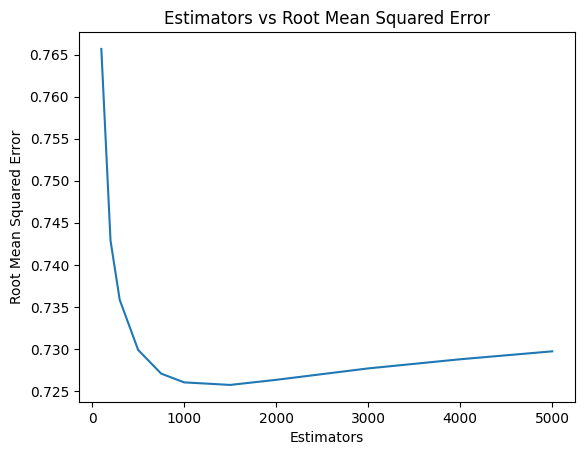

### Random Forest

For Random Forest, the hyperparameters were selected to enhance ensemble diversity and model robustness:

- **n_estimators (100, 200, 500)**: Balanced the number of trees to ensure learning patterns without taking too long to train, and overfitting to the train set.
- **max_depth (20, 30, 40)**: Restricted the tree depth to control overfitting.
- **min_samples_split (30, 40)**: Increased the threshold for node splits to avoid capturing noise.
- **max_features ('auto', 50, 63)**: Balanced feature diversity and model performance by controlling the number of features considered at each split.
- **bootstrap (True, False)**
- **max_leaf_nodes (None, 30, 50, 100)**: Controlled tree complexity by limiting the number of leaf nodes.
- **ccp_alpha (0.0, 0.1, 0.2)**: Simplified trees by applying pruning to remove insignificant branches and avoid overfitting.

Random search was utilized to identify optimal hyperparameter combinations, ensuring a balance between model complexity and generalization.

## Data Splits

To ensure robust model evaluation and prevent overfitting, the dataset was partitioned using a train-test split combined with 5-fold cross-validation:

I allocated 85% of the data for training and validation, and 15% as a hold-out test set. This split ensured that a substantial portion of the data was used for training while maintaining a sufficiently large test set for unbiased performance evaluation. Using larger train sets would sometimes mean my validation set was too small to accurately predict what my score will be on the Kaggle, effectively wasting some of my daily submissions, while using a smaller train set would mean my model would not be as accurate. I landed on 85% as a good compromise after trying different values.

Within the training set, 5-fold cross-validation was employed. The training data was divided into five equal subsets (folds). In each iteration, four folds were used for training, and the remaining fold for validation. This process was repeated five times, with each fold serving as the validation set once. The results were averaged to obtain a reliable performance metric.

5-fold cross-validation offered a compromise between speed of training and the trustworthiness of the validation score (2550 validation data points), ensuring that the model generalizes well to unseen data.

## Reflection on Progress

Throughout the competition, I experimented with various models, including linear regressions and neural networks. As expected, linear regressions performed poorly due to the non-linear relationships in the data. Neural networks, despite their capability to capture complex patterns, struggled with the dataset's size and feature complexity, resulting in suboptimal performance on the Kaggle leaderboard.

Switching to tree-based models, specifically LightGBM and Random Forest, yielded better results. LightGBM, in particular, benefited from extensive hyperparameter tuning and feature engineering, leading to superior performance compared to Random Forest. The primary challenge was trying different hyperparameters and ways to feature engineer in the given time limit, which meant I couldn't experiment with everything I wanted to. Additionally, integrating NLP features such as sentiment analysis was time-consuming and constrained by API rate limits, impacting how quickly I could update those features; review sentiment analysis took over 24 hours to run.

Ultimately, LightGBM achieved the best performance with a Kaggle score of approximately 0.75173, while Random Forest scored around 0.77240. These results highlighted the effectiveness of tree-based models in handling the dataset's characteristics and underscored the importance of targeted feature engineering and efficient hyperparameter optimization.

## Predictive Performance

### LightGBM

The LightGBM model demonstrated strong performance, although overfit to the train set. However, it still maintained better validation and competition performance compared to Random Forest.

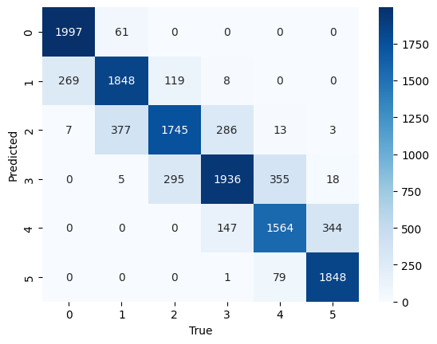
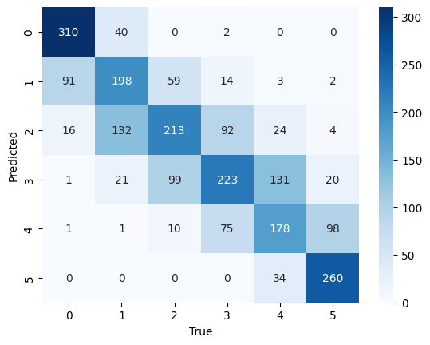

The confusion matrices indicate that errors on the validation set were often towards predicting values closer to the mean, such as predicting 1 instead of 0, suggesting a tendency to generalize rather than capture extreme values.

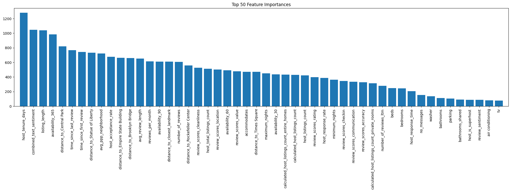

The most useful features are host-related metrics like `host_tenure_days` and `host_acceptance_rate`, location-based features such as proximity to landmarks (`distance_to_Central_Park`), listing information like `combined_text_sentiment` and finally review metrics (`avg_review_length`, `reviews_per_month`). These suggest that host reliability and description, location, and user feedback strongly influence predictions. In contrast, less useful features include specific amenities like `washer`, `parking`, and `tv`, and property details such as `bathrooms_shared` and `private_rooms`, which have a smaller impact compared to broader factors. This aligns with the intuition that general listing characteristics and host reputation are more indicative of price than specific amenities.

### Random Forest

The Random Forest model exhibited slight overfitting, achieving higher accuracy on the training and validation sets compared to the competition score.

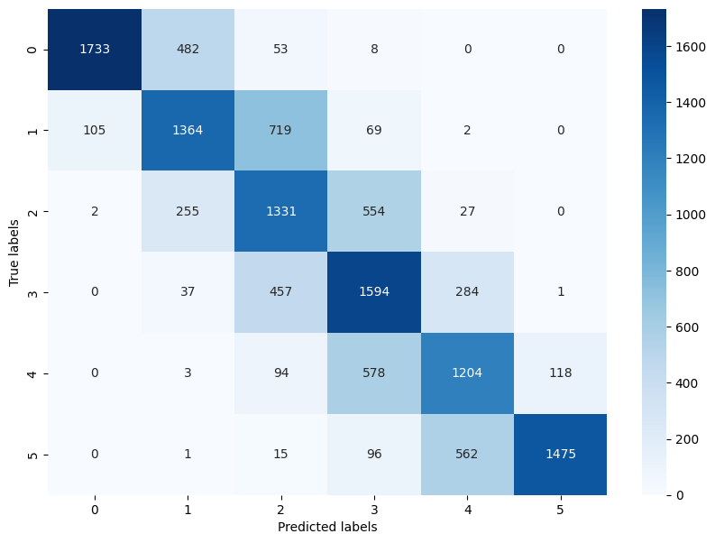
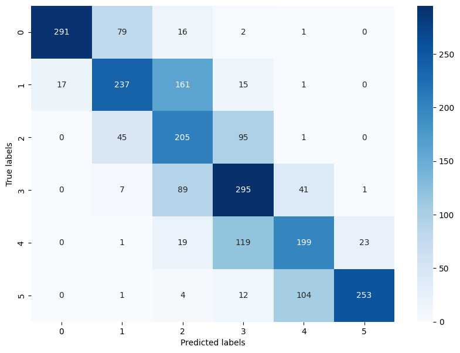

Most prediction errors were within adjacent bins, such as predicting higher values for lower bins and lower values for higher bins. This pattern likely resulted from overfitting and noise in the data.

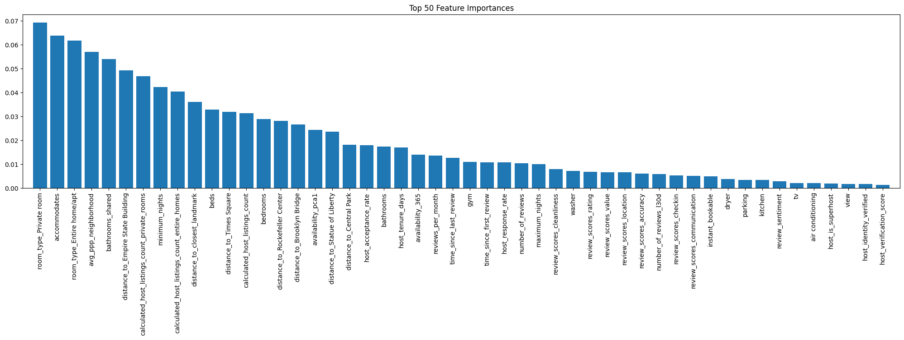

The most important features in the Random Forest model are property-related variables such as `room_type_Private_room`, `room_type_Entire_home/apt`, and `accommodates`. These indicate a strong emphasis on property type and capacity, in contrast to LightGBM, which prioritized host-related metrics like `host_tenure_days` and textual feedback such as `combined_text_sentiment`. Location features like `distance_to_Times_Square` and `distance_to_Empire_State_Building` remain influential but are slightly less dominant compared to LightGBM.

The least useful features in Random Forest include amenities such as `air_conditioning`, `tv`, and `parking`, as well as verification-related features like `host_identity_verified` and `host_verification_score`. This is consistent with LightGBM, where these variables were also low-ranking. However, Random Forest places less emphasis on review metrics like `review_sentiment` and `avg_review_length`, which were highly important in LightGBM.

An interesting difference to note is that my LightGBM models seem to not accord much importance to the Room type, whereas the Random Forest model does.

Overall, Random Forest prioritizes physical and capacity-related listing attributes, whereas LightGBM focuses more on host experience, location, and user feedback, highlighting a significant difference in feature importance distribution between the two models.

# Conclusion

This writeup details the comprehensive approach taken to analyze, clean, and model the AirBnB dataset for the Kaggle competition. The combination of targeted feature engineering, robust imputation strategies, and the selection of powerful tree-based models like LightGBM and Random Forests led to competitive performance, demonstrating the effectiveness of these techniques in handling complex, real-world datasets.
